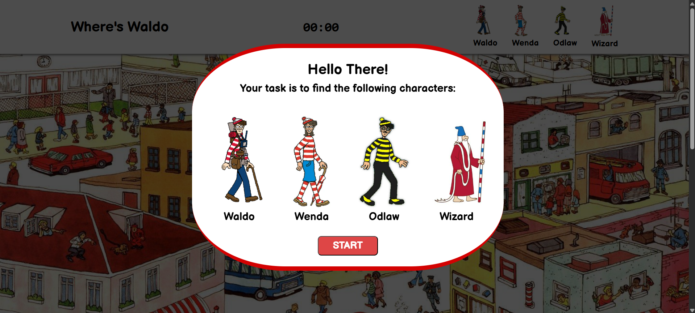
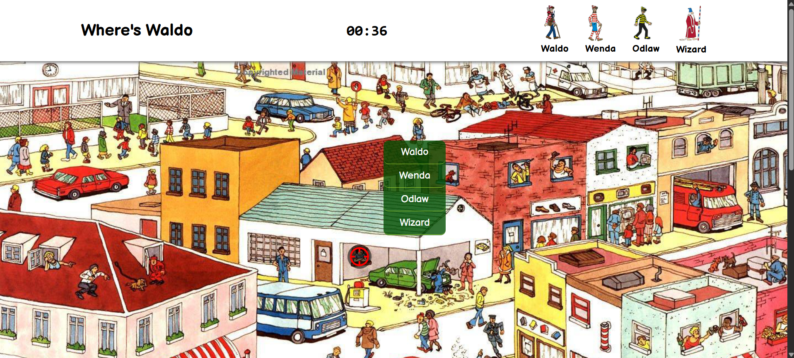
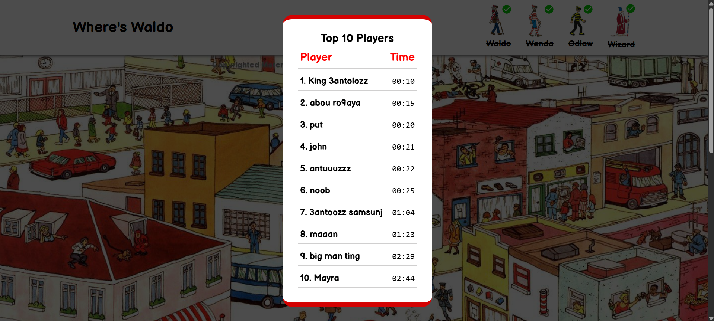

# Where is Waldo ? (A Photo Tagging App)

Where is Waldo is a Photo Tagging game where your goal is to find all the hidden characters. After finding all of them, you can submit your score on the leaderboard, sorted by fastest times.

## Welcome Interface



## Main Interface



## Leaderboard



## Features

- Server side character location checking.
- Server side stopwatch timer to prevent cheating.
- Top-10 leaderboard sorted by fastest times.

## Why build this project ?

This was one of the first FullStack projects I created, it's purpose was to tie everything I learned together in a fun project.

## Technologies Used

### Frontend

- Javascript
- React
- Vite
- Vercel

### Backend

- Express
- Nodejs
- PostgreSQL
- Prisma ORM
- Socket.IO
- OnRender
- Neon

## 🛠️ How to Run the Project Locally

### Prerequisites

- [Node.js](https://nodejs.org/)
- [npm](https://www.npmjs.com/)
- [PostgreSQL](https://www.postgresql.org/) (ensure your database is running)
- Basic knowledge of using a terminal (steps are beginner-friendly)

---

### 1. Clone the Repository

```bash
git clone https://github.com/3antozz/Where-is-Waldo
cd Where-is-Waldo
```

### 2. Setup the Backend (API)

```bash
cd api
npm install
```

**1- Create a .env file in the api/ directory (based on .env.example) and fill in the required environment variables such as:** 

* Database connection URL
* Session secret

2- Start the backend server:

```bash
npm start
```
> [!NOTE]
> The backend will run on http://localhost:3000 by default.

### 3. Setup the Frontend (Client)

1- Open a new terminal window or tab:
```bash
cd client
npm install
npm run dev
```
**2- Rename the .env.example file to .env in the client/ directory**

> [!NOTE]
> The frontend will run on http://localhost:5173 by default.

### 4. Open in Browser

1- Once both servers are running:

2- Visit http://localhost:5173 in your browser

## Libraries Used

### Frontend

- [Lucide React](https://lucide.dev/guide/packages/lucide-react) – Import Icons.

### Backend

- [express-session](https://www.npmjs.com/package/express-session) – Simple session middleware for Authenticating.
- [passport-github2](https://www.npmjs.com/package/passport-github2) – This module lets you authenticate using GitHub OAuth 2.0 in your Node.js applications. 
- [prisma-session-store](https://www.npmjs.com/package/@quixo3/prisma-session-store) – An express session store implementation for the Prisma ORM.
- [express-validator](https://www.npmjs.com/package/express-validator) – User input validation middleware.
- [express-async-handler](https://www.npmjs.com/package/express-async-handler) – Asynchronous exception-handling middleware.
- [cors](https://www.npmjs.com/package/cors) – Package for providing a Connect/Express middleware that can be used to enable CORS.
